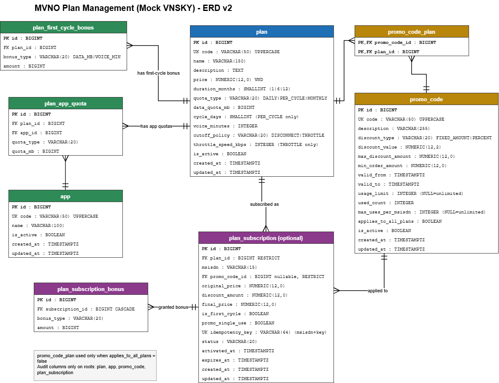

# MVNO Plan Management

Spring Boot 3.2, Java 21, PostgreSQL service for managing MVNO plans.

## Run with Docker Compose

Set `POSTGRES_DB`, `POSTGRES_USER`, and `POSTGRES_PASSWORD` in `.env`, then start the stack:

```sh
docker compose up --build
```

Flyway creates the schema and inserts the starter data. The API is available under `/api/v1`; Swagger UI is at `/api/v1/swagger-ui.html`.

## Plan API

All successful operations return HTTP 200 with an `ApiResponse` body (`code: 1000`).

| Method | Path | Purpose |
|---|---|---|
| `POST` | `/api/v1/plans` | Create a plan |
| `GET` | `/api/v1/plans` | Search and page through plans |
| `GET` | `/api/v1/plans/{planId}` | Get plan details |
| `PUT` | `/api/v1/plans/{planId}` | Replace plan fields and child rows |
| `PATCH` | `/api/v1/plans/{planId}/status` | Activate or deactivate a plan |
| `DELETE` | `/api/v1/plans/{planId}` | Delete a plan unless a subscription uses it |
| `GET` | `/api/v1/apps` | List apps, optionally filtered by `isActive` |
| `POST` | `/api/v1/apps` | Create an app |
| `PUT` | `/api/v1/apps/{appId}` | Update an app |
| `PATCH` | `/api/v1/apps/{appId}/status` | Activate or deactivate an app |
| `DELETE` | `/api/v1/apps/{appId}` | Delete an app unless a plan quota uses it |
| `GET` | `/api/v1/promo-codes` | Search and page through promo codes |
| `POST` | `/api/v1/promo-codes` | Create a promo code |
| `GET` | `/api/v1/promo-codes/{promoId}` | Get promo details and plan scope |
| `PUT` | `/api/v1/promo-codes/{promoId}` | Replace promo configuration and scope |
| `PATCH` | `/api/v1/promo-codes/{promoId}/status` | Activate or deactivate a promo |
| `DELETE` | `/api/v1/promo-codes/{promoId}` | Delete a promo code |
| `POST` | `/api/v1/promo-codes/validate` | Validate a promo against a plan price |

List filters: `isActive`, `keyword`, `durationMonths`, `page`, `size`, and allowlisted `sort` (for example `createdAt,desc`).

App and promo lists accept `isActive`, `page`, `size`, and allowlisted `sort`; promo lists also accept `keyword`. Promo validation is advisory: it does not consume usage, and the optional `msisdn` is ignored until subscription registration is implemented. The `SIM10K` seed promo is available for validation on orders of at least 50,000 VND.

MVNO Plan Management (Mock VNSKY) - ERD

